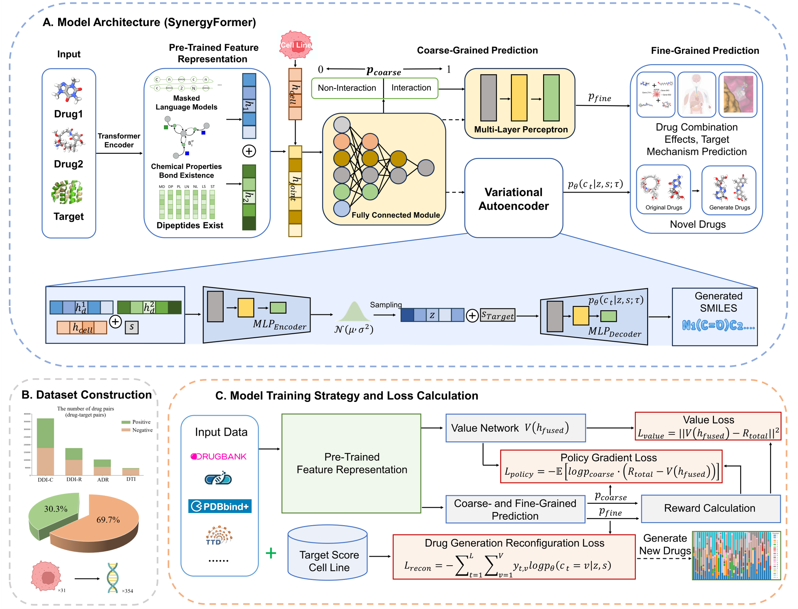

# SynergyFormer
## 💡 Description
This is the official implementation of SynergyFormer: A unified hierarchical reinforcement learning framework for predicting and generating synergistic drug combinations.

SynergyFormer integrates self-supervised pre-trained feature representations, adaptive coarse-to-fine prediction, and conditional drug generation. It achieves state-of-the-art performance in:

DDI & Synergy Prediction: Classifying interaction types and regressing synergy scores.
DTI Prediction: Predicting Drug-Target Interactions and Mechanism of Action (MoA).
ADR Prediction: Predicting organ-specific Adverse Drug Reactions.
Drug Generation: Generating novel synergistic drug candidates using a VAE-based generative model.

## 📋 Table of Contents
1. [💡 Description](#description)
2. [📁 File Structure](#file-structure)
3. [🔍 Datasets](#datasets)
4. [🧠 Model Architecture](#model-architecture)
5. [⚙️ Installation](#installation)
6. [🚀 Training & Evaluation](#training--evaluation)
7. [📧 Contact](#contact)

## 📁 File Structure
The project is organized as follows based on your directory structure:

```
SynergyFormer/
│
├── data/                   # Dataset CSV files
│   ├── ADR_D.csv           # DrugBank ADR dataset
│   ├── ADR_T.csv           # TWOSIDES ADR dataset
│   ├── DDI_a_gen.csv       # ALMANAC dataset for generation
│   ├── DDI_c.csv           # DDI Classification dataset
│   ├── DDI_o.csv           # O'Neil Synergy Regression dataset
│   ├── DDI_o_gen.csv       # O'Neil dataset for generation
│   └── DTI.csv             # Drug-Target Interaction dataset
│
├── results/                # Saved model weights (.pth)
│   ├── Model_DDI_R.pth     # Trained DDI Regression model
│   ├── Model_gen.pth       # Trained Generation model
│   ├── pre_drug.pth        # Pre-trained Drug Transformer weights
│   └── pre_target.pth      # Pre-trained Protein Transformer weights
│
├── Model_ADR.py            # Code for Adverse Drug Reaction prediction
├── Model_DDI_C.py          # Code for DDI Classification (86 types)
├── Model_DDI_R.py          # Code for DDI Synergy Regression
├── Model_DTI.py            # Code for DTI and MoA prediction
├── Model_gen.py            # Code for Drug Generation (VAE)
├── Pre_drug.py             # Code for Drug Pre-training
├── Pre_target.py           # Code for Target Pre-training
└── README.md               # Project documentation

```

## 🔍 Datasets
All data files are located in the `data/` directory:
DDI Synergy: `DDI_o.csv` (O'Neil) and `DDI_c.csv` (Classification).
Generation: `DDI_o_gen.csv` and `DDI_a_gen.csv`.
DTI: `DTI.csv` containing drug-target pairs and MoA labels.
ADR: `ADR_D.csv` (Dataset-D) and `ADR_T.csv` (Dataset-T).

## 🧠 Model Architecture
The framework consists of three main modules:
1. Pre-trained Feature Representation: Transformer-based encoders for Drugs and Targets using Masked Language Modeling (MLM).
2. Hierarchical RL Prediction: Adaptive coarse-to-fine prediction for interactions (DTI, DDI, ADR) using policy gradients.
3. Generative Optimization: A VAE-based model to generate optimized synergistic drugs.



## ⚙️ Installation
We recommend using Anaconda to manage the environment to ensure version compatibility.

```bash
# 1. Create environment with specific Python version
conda create -n SynergyFormer python=3.8.10
conda activate SynergyFormer

# 2. Install RDKit (Recommended via Conda)
conda install -c conda-forge rdkit=2024.03.5

# 3. Install PyTorch (CUDA 12.1 version)
# Note: Using pip ensures the exact version match (2.4.1+cu121)
pip install torch==2.4.1 torchvision torchaudio --index-url [https://download.pytorch.org/whl/cu121](https://download.pytorch.org/whl/cu121)

# 4. Install other specific dependencies
pip install pandas==2.0.3 numpy==1.22.4 scikit-learn==1.3.2 scipy==1.10.1 tqdm==4.61.2

```

## 🚀 Training & Evaluation
Below are the commands to run each module.
Note: The pre-trained weights are located in the `results/` folder.

### 1. Pre-training (Feature Representation)

If you want to re-train the feature extractors from scratch:

```bash
python Pre_drug.py --pretrain_data data/DTI.csv --output results/drug_embeddings.csv
python Pre_target.py --pretrain_data data/DTI.csv --output results/target_embeddings.csv

```

### 2. Drug Synergy Prediction (Regression)

Train the regression model on the O'Neil dataset (`DDI_o.csv`) using the pre-trained drug weights (`pre_drug.pth`):

```bash
python Model_DDI_R.py \
  --data data/DDI_o.csv \
  --drug_model results/pre_drug.pth \
  --epochs 80 \
  --output results/predictions_regression.csv

```

### 3. DDI Classification

Train the multi-type classification model (86 types) using `DDI_c.csv`:

```bash
python Model_DDI_C.py \
  --data data/DDI_c.csv \
  --drug_model results/pre_drug.pth \
  --threshold 0.5

```

### 4. Drug-Target Interaction (DTI & MoA)

Train the DTI model using `DTI.csv`. This requires both drug and target pre-trained weights:

```bash
python Model_DTI.py \
  --data data/DTI.csv \
  --drug_model results/pre_drug.pth \
  --protein_model results/pre_target.pth \
  --epochs 50

```

### 5. Adverse Drug Reaction (ADR)

Train the ADR prediction model on Dataset-D (`ADR_D.csv`) or Dataset-T (`ADR_T.csv`):

```bash
python Model_ADR.py \
  --data data/ADR_D.csv \
  --drug_model results/pre_drug.pth \
  --epochs 50

```

### 6. Drug Generation

Train the generative model (VAE) to optimize drug synergy. This uses the paired generation data (`DDI_o_gen.csv`):

```bash
python Model_gen.py \
  --synergy_data_path data/DDI_o.csv \
  --generation_data_path data/DDI_o_gen.csv \
  --pretrained_drug_model results/pre_drug.pth \
  --output_path results/

```

## 📧 Contact

For any questions, please contact:

Jiangning Song: jiangning.song@monash.edu
Dong-Jun Yu: njyudj@njust.edu.cn


